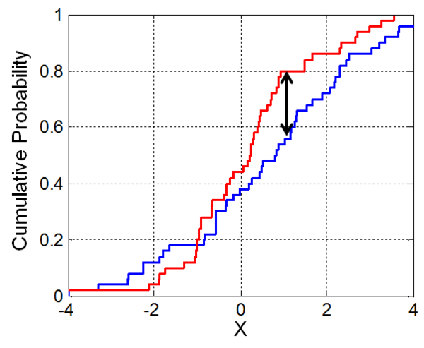
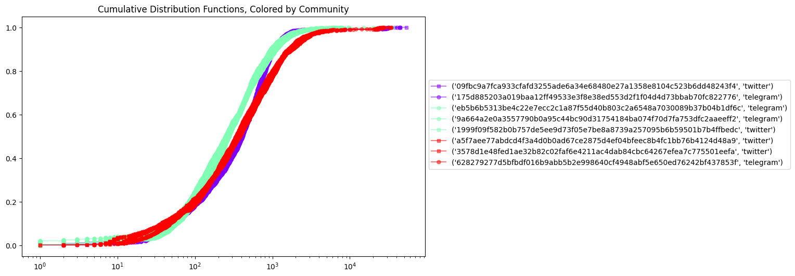

## Cross-Platform Latent Connectivity Detection using the Temporal Dimension

### Social Media Usecase

Not all connections between individuals are apparent in the structural network data we have access to. One example to such scenario is when individuals employ different platforms of communications, which inherently lack inter-platform connections.

In this demo, we demonstrate the ability to detect communities whose members act on separate platforms, despite the absence of explicit connections between them.
We introduce the concept of an individual's temporal fingerprint, defined by the time gaps between consecutive activities (inter-event time distribution), and find that community members present similar temporal fingerprints. 

This methodology uses merely the temporal metadata of users' activity, and does not require access to network structure or user generated content. As such, it can be employed on any type of temporal dataset, including encrypted domains.

**Overview**
1. Loading the data
2. Preprocessing
3. Visualizations
4. Evaluation

**Files:**
1. posts.csv: raw metadata of posting activity (see Section 1: Loading the data)
2. tagged_communities: labeled data of true communities of collaborators


**Data Labeling**

We label a group of profiles as belonging to the same community if their profile names, biographies, or public activity indicate they belong to, represent, or work under the same organization. The matching process included surfacing pairs of profiles - typically organizations - with very similar names, and affirming their relationship manually by reviewing their respective profiles. Additionally, we searched for and included affilliates and subsidiaries of organizations, which we found via biographical information, although those account for a small portion of the data.

Examples of communities:
1. [(@company1, twitter), (@company1, telegram)]
2. [(@company2_worker1, instagram), (@company2_worker2, telegram), (@company2_worker3, twitter)]

**Data Disclaimer**

The data was scraped and provided by a third party and carefully tagged using the guidelines above.

**Citation**

If you find our work useful, please kindly consider citing the original paper: https://arxiv.org/pdf/2407.04350

### Loading the Data

The dataset includes posting activity metadata collected over the span of 18 days from various social media platforms such as twitter (X), telegram, and instagram. The schema:
- "creator_name" (string): encryped name of the profile that posted 
- "platform_type" (string): the social platform to which the profile belongs
- "creation_time" (string): the date and time at which the post was created, in the format of %Y-%m-%d %H:%M:%S

*Note: a 'user' is defined as a unique pair of "creator_name" and "platform_type".*


```python
import pandas as pd
from datetime import datetime
import numpy as np
from scipy.stats import ks_2samp
import networkx as nx

import matplotlib.pyplot as plt
from matplotlib.lines import Line2D

from typing import Iterable, Tuple
from sklearn.metrics import normalized_mutual_info_score

from typing import List

```


```python
# load the post metadata
posts_df = pd.read_csv("posts.csv", header=0, index_col=0)

# save column names as constants
PROFILE_COL_NAME, PLATFORMS_COL_NAME, CREATION_TIMES_COL_NAME = posts_df.columns

posts_df
```


<div>
<table border="1" class="dataframe">
  <thead>
    <tr style="text-align: right;">
      <th></th>
      <th>creator_name</th>
      <th>platform_type</th>
      <th>creation_time</th>
    </tr>
  </thead>
  <tbody>
    <tr>
      <th>0</th>
      <td>48b8e55428ffcd743a5ed414af8fc20035b84f9180cce2...</td>
      <td>telegram</td>
      <td>2024-06-09 11:39:37</td>
    </tr>
    <tr>
      <th>1</th>
      <td>2f27773944b2d3582c3a081081423a4c91c7f637418452...</td>
      <td>twitter</td>
      <td>2024-06-16 08:09:51</td>
    </tr>
    <tr>
      <th>2</th>
      <td>2fd96e566ebff9cf51b86cd38a96da73c64925a5831c7b...</td>
      <td>twitter</td>
      <td>2024-06-11 01:08:08</td>
    </tr>
    <tr>
      <th>3</th>
      <td>2fd96e566ebff9cf51b86cd38a96da73c64925a5831c7b...</td>
      <td>twitter</td>
      <td>2024-06-13 02:14:35</td>
    </tr>
    <tr>
      <th>4</th>
      <td>a5f7aee77abdcd4f3a4d0b0ad67ce2875d4ef04bfeec8b...</td>
      <td>twitter</td>
      <td>2024-06-08 08:49:19</td>
    </tr>
    <tr>
      <th>...</th>
      <td>...</td>
      <td>...</td>
      <td>...</td>
    </tr>
    <tr>
      <th>59775</th>
      <td>48b8e55428ffcd743a5ed414af8fc20035b84f9180cce2...</td>
      <td>telegram</td>
      <td>2024-06-20 08:53:30</td>
    </tr>
    <tr>
      <th>59776</th>
      <td>2f27773944b2d3582c3a081081423a4c91c7f637418452...</td>
      <td>twitter</td>
      <td>2024-06-17 13:54:39</td>
    </tr>
    <tr>
      <th>59777</th>
      <td>dafb8d942d9ec6ab6a6eb49f3c1b3625283df0274544e4...</td>
      <td>twitter</td>
      <td>2024-06-18 18:43:03</td>
    </tr>
    <tr>
      <th>59778</th>
      <td>175d885203a019baa12ff49533e3f8e38ed553d2f1f04d...</td>
      <td>telegram</td>
      <td>2024-06-13 13:40:03</td>
    </tr>
    <tr>
      <th>59779</th>
      <td>b88a62af2a90360538840b46d759e122d306bb051b9d87...</td>
      <td>telegram</td>
      <td>2024-06-16 13:06:45</td>
    </tr>
  </tbody>
</table>
<p>59780 rows × 3 columns</p>
</div>


### Preprocessing

To extract communities from the data, we'll first need to establish and evaluate the relationship between each pair of users.

That includes a few simple steps:

0. (Type casting)
1. Grouping activity per user
2. Computing the silence periods between each of the user's posts
3. Computing the Kolmogorov-Smirnov distance between each pair of users


```python
# Convert string timestamps into datetime type
posts_df[CREATION_TIMES_COL_NAME] = (
    posts_df[CREATION_TIMES_COL_NAME].apply(lambda t: datetime.strptime(t, '%Y-%m-%d %H:%M:%S'))
)
```

#### Computing Silence Periods

A silence period is a period of time that elapsed between two consecutive events. In our case, we will define it as the time, in seconds between each posts by the same user.

*(Note: Since we later plot the silence period distributions on a log-log scale, we add a precautionary 1 second to all silence periods to avoid a log(0) value)*


```python
# sort posting times per user
posts_df = posts_df.sort_values([PROFILE_COL_NAME, PLATFORMS_COL_NAME, CREATION_TIMES_COL_NAME])

def aggregate_and_compute_silence_periods(user_data: pd.DataFrame) -> pd.Series:
    """Compute inter-event periods and collect information per user"""
    
    silence_periods = user_data[CREATION_TIMES_COL_NAME].diff().dt.seconds.add(1).dropna().tolist()
    creation_times = user_data[CREATION_TIMES_COL_NAME].tolist()
    return pd.Series([creation_times, silence_periods])

grouped_df = posts_df.groupby([PROFILE_COL_NAME, PLATFORMS_COL_NAME]).apply(aggregate_and_compute_silence_periods)
grouped_df.columns = ["creation_times", "silence_periods"]

grouped_df.head(5)
```


<div>
<table border="1" class="dataframe">
  <thead>
    <tr style="text-align: right;">
      <th></th>
      <th></th>
      <th>creation_times</th>
      <th>silence_periods</th>
    </tr>
    <tr>
      <th>creator_name</th>
      <th>platform_type</th>
      <th></th>
      <th></th>
    </tr>
  </thead>
  <tbody>
    <tr>
      <th>09fbc9a7fca933cfafd3255ade6a34e68480e27a1358e8104c523b6dd48243f4</th>
      <th>twitter</th>
      <td>[2024-06-08 03:42:40, 2024-06-08 03:46:44, 202...</td>
      <td>[245.0, 856.0, 284.0, 748.0, 41.0, 94.0, 739.0...</td>
    </tr>
    <tr>
      <th>175d885203a019baa12ff49533e3f8e38ed553d2f1f04d4d73bbab70fc822776</th>
      <th>telegram</th>
      <td>[2024-06-08 03:42:00, 2024-06-08 03:46:11, 202...</td>
      <td>[252.0, 296.0, 548.0, 291.0, 755.0, 45.0, 97.0...</td>
    </tr>
    <tr>
      <th>1999f09f582b0b757de5ee9d73f05e7be8a8739a257095b6b59501b7b4ffbedc</th>
      <th>twitter</th>
      <td>[2024-06-08 02:05:42, 2024-06-08 02:07:30, 202...</td>
      <td>[109.0, 56.0, 193.0, 44.0, 147.0, 915.0, 603.0...</td>
    </tr>
    <tr>
      <th>1f8c56c6b8021ba24d3c15c678ea6651c133b73fe8cc899107f9c68866c6c3b6</th>
      <th>twitter</th>
      <td>[2024-06-08 03:26:57, 2024-06-08 03:43:54, 202...</td>
      <td>[1018.0, 7698.0, 1.0, 1973.0, 106.0, 1.0, 1335...</td>
    </tr>
    <tr>
      <th>2f27773944b2d3582c3a081081423a4c91c7f63741845274ecc2e87012ecd99d</th>
      <th>twitter</th>
      <td>[2024-06-08 02:06:44, 2024-06-08 02:09:27, 202...</td>
      <td>[164.0, 343.0, 474.0, 24.0, 1.0, 364.0, 593.0,...</td>
    </tr>
  </tbody>
</table>
</div>


```python
# [Optional] Filter based on minimum activity, in our case, about one post per day
MINIMUM_ACTIVITY = 20
grouped_df = grouped_df[grouped_df["creation_times"].apply(len) >= MINIMUM_ACTIVITY]
```

#### Computing the KS (Kolmogorov–Smirnov) distance

The [Kolmogorov–Smirnov test](https://en.wikipedia.org/wiki/Kolmogorov%E2%80%93Smirnov_test) is a nonparametric test for determining whether two samples of data came from the same distribution, or in the other words, the likelihood of observing the two samples of data given that they were drawn from the same probability distribution.

The outcome (statistic) of the test is the maximum distance per value observed between the two provided empirical distributions:



We will employ this test to evaluate the similarity between the inter-event time distributions of every pair of users, where lower KS values indicate closer distributions. Our hypothesis is that community members will have similar inter-event time distributions.

*Note: for large datasets, we recommend using a parallelized framework like Spark instead of pandas*


```python

N = len(grouped_df)
ks_results = []

# compare every pair of users, skipping symmetrical and self comparisons
for i in range(N):
    for j in range(i+1, N):
        user1 = grouped_df.iloc[i]
        user2 = grouped_df.iloc[j]
        sp1 = user1.silence_periods
        sp2 = user2.silence_periods
        
        # compute the KS statistic
        ks, p_val = ks_2samp(sp1, sp2)
        ks_results.append((*user1.name, *user2.name, float(ks), float(p_val)))

ks_results = pd.DataFrame(
    ks_results,
    columns=[
        PROFILE_COL_NAME + "_1",
        PLATFORMS_COL_NAME + "_1",
        PROFILE_COL_NAME + "_2",
        PLATFORMS_COL_NAME + "_2",
        "statistic",
        "p_val"
    ]
)
ks_results.head(5)
```


<div>
<table border="1" class="dataframe">
  <thead>
    <tr style="text-align: right;">
      <th></th>
      <th>creator_name_1</th>
      <th>platform_type_1</th>
      <th>creator_name_2</th>
      <th>platform_type_2</th>
      <th>statistic</th>
      <th>p_val</th>
    </tr>
  </thead>
  <tbody>
    <tr>
      <th>0</th>
      <td>09fbc9a7fca933cfafd3255ade6a34e68480e27a1358e8...</td>
      <td>twitter</td>
      <td>175d885203a019baa12ff49533e3f8e38ed553d2f1f04d...</td>
      <td>telegram</td>
      <td>0.018862</td>
      <td>8.578377e-01</td>
    </tr>
    <tr>
      <th>1</th>
      <td>09fbc9a7fca933cfafd3255ade6a34e68480e27a1358e8...</td>
      <td>twitter</td>
      <td>1999f09f582b0b757de5ee9d73f05e7be8a8739a257095...</td>
      <td>twitter</td>
      <td>0.135250</td>
      <td>5.904891e-20</td>
    </tr>
    <tr>
      <th>2</th>
      <td>09fbc9a7fca933cfafd3255ade6a34e68480e27a1358e8...</td>
      <td>twitter</td>
      <td>1f8c56c6b8021ba24d3c15c678ea6651c133b73fe8cc89...</td>
      <td>twitter</td>
      <td>0.326619</td>
      <td>3.721302e-45</td>
    </tr>
    <tr>
      <th>3</th>
      <td>09fbc9a7fca933cfafd3255ade6a34e68480e27a1358e8...</td>
      <td>twitter</td>
      <td>2f27773944b2d3582c3a081081423a4c91c7f637418452...</td>
      <td>twitter</td>
      <td>0.343118</td>
      <td>3.618397e-148</td>
    </tr>
    <tr>
      <th>4</th>
      <td>09fbc9a7fca933cfafd3255ade6a34e68480e27a1358e8...</td>
      <td>twitter</td>
      <td>2fd96e566ebff9cf51b86cd38a96da73c64925a5831c7b...</td>
      <td>twitter</td>
      <td>0.297279</td>
      <td>2.638333e-116</td>
    </tr>
  </tbody>
</table>
</div>


### Analysis & Evaluation

Now that we have computed the KS-distance for every pair of users, we will use it to determine communities among users.

**Filtering**

First, we want to get rid of "weak" connections and only keep strongly-connected pairs of users. After rersearching different synchronization thresholds (see also: https://arxiv.org/pdf/2407.04350), we use an upper bound of 0.04 to define a strong connection.


```python
KS_THRESHOLD = 0.04
ks_results = ks_results[ks_results["statistic"] <= KS_THRESHOLD]
```

Now, we want to transform the KS statistic to capture the reversed nature of it (the smaller - the better, and the rarer), and build a graph where the users as nodes and the transformed KS as weighted edges between nodes.

Given the nature of the KS distance, we transform it by exponentiating its inverse.

$ks \in [0,1]$

$ks_{inverse} = \frac{1}{ks + \epsilon} \in (1, \infty] \text{   for } \epsilon > 0$

$ks_{normalized} := \exp{(ks_{inverse})} - \exp{(1)} \in (0, \infty]$


```python
# transform the KS distance 

def reverse_normalize_ks(ks: pd.Series):
    
    # add a tiny epsilon to avoid division by zero
    epsilon = 1e-5
    ks_inverse = 1 / (ks + epsilon)
    return np.e ** (ks_inverse) - np.e

ks_results["normalized_ks"] = reverse_normalize_ks(ks_results["statistic"])
ks_results
```


<div>
<table border="1" class="dataframe">
  <thead>
    <tr style="text-align: right;">
      <th></th>
      <th>creator_name_1</th>
      <th>platform_type_1</th>
      <th>creator_name_2</th>
      <th>platform_type_2</th>
      <th>statistic</th>
      <th>p_val</th>
      <th>normalized_ks</th>
    </tr>
  </thead>
  <tbody>
    <tr>
      <th>0</th>
      <td>09fbc9a7fca933cfafd3255ade6a34e68480e27a1358e8...</td>
      <td>twitter</td>
      <td>175d885203a019baa12ff49533e3f8e38ed553d2f1f04d...</td>
      <td>telegram</td>
      <td>0.018862</td>
      <td>0.857838</td>
      <td>1.030415e+23</td>
    </tr>
    <tr>
      <th>46</th>
      <td>1999f09f582b0b757de5ee9d73f05e7be8a8739a257095...</td>
      <td>twitter</td>
      <td>9a664a2e0a3557790b0a95c44bc90d31754184ba074f70...</td>
      <td>telegram</td>
      <td>0.033304</td>
      <td>0.050580</td>
      <td>1.087417e+13</td>
    </tr>
    <tr>
      <th>53</th>
      <td>1999f09f582b0b757de5ee9d73f05e7be8a8739a257095...</td>
      <td>twitter</td>
      <td>eb5b6b5313be4c22e7ecc2c1a87f55d40b803c2a6548a7...</td>
      <td>telegram</td>
      <td>0.035813</td>
      <td>0.026620</td>
      <td>1.328125e+12</td>
    </tr>
    <tr>
      <th>101</th>
      <td>3578d1e48fed1ae32b82c02faf6e4211ac4dab84cbc642...</td>
      <td>twitter</td>
      <td>628279277d5bfbdf016b9abb5b2e998640cf4948abf5e6...</td>
      <td>telegram</td>
      <td>0.036776</td>
      <td>0.183593</td>
      <td>6.396621e+11</td>
    </tr>
    <tr>
      <th>106</th>
      <td>3578d1e48fed1ae32b82c02faf6e4211ac4dab84cbc642...</td>
      <td>twitter</td>
      <td>a5f7aee77abdcd4f3a4d0b0ad67ce2875d4ef04bfeec8b...</td>
      <td>twitter</td>
      <td>0.028545</td>
      <td>0.460414</td>
      <td>1.617940e+15</td>
    </tr>
    <tr>
      <th>139</th>
      <td>628279277d5bfbdf016b9abb5b2e998640cf4948abf5e6...</td>
      <td>telegram</td>
      <td>a5f7aee77abdcd4f3a4d0b0ad67ce2875d4ef04bfeec8b...</td>
      <td>twitter</td>
      <td>0.033609</td>
      <td>0.273114</td>
      <td>8.284705e+12</td>
    </tr>
  </tbody>
</table>
</div>


```python
# Create a graph of the users where the users are nodes and the weighted edges are the normalized KS
def create_graph_from_data(data: pd.DataFrame, weight_col: str) -> nx.Graph:
    """
    Builds a weighted graph from pair-based data. The function assumes the dataframe has the columns: 
        - "creator_name_1"
        - "platform_type_1
        - "creator_name_2"
        - "platform_type_2"
        - [weight column]
    
    """
    G = nx.Graph()
    G.add_weighted_edges_from(
        [
            (
                (row[PROFILE_COL_NAME + "_1"], row[PLATFORMS_COL_NAME + "_1"]),
                (row[PROFILE_COL_NAME + "_2"], row[PLATFORMS_COL_NAME + "_2"]),
                row[weight_col],
            )
            for _, row in data.iterrows()
        ]
    )
    return G

G_ks = create_graph_from_data(ks_results, "normalized_ks")
# Extract commmunities using the louvain algorithm
ks_communities = nx.community.louvain_communities(G_ks)

# remove from the graph profiles that were not included in any community
users_in_communities = {node for community in ks_communities for node in community}
G_ks.remove_nodes_from({user for user in G_ks if user not in users_in_communities})

ks_communities
```


    [{('09fbc9a7fca933cfafd3255ade6a34e68480e27a1358e8104c523b6dd48243f4',
       'twitter'),
      ('175d885203a019baa12ff49533e3f8e38ed553d2f1f04d4d73bbab70fc822776',
       'telegram')},
     {('1999f09f582b0b757de5ee9d73f05e7be8a8739a257095b6b59501b7b4ffbedc',
       'twitter'),
      ('9a664a2e0a3557790b0a95c44bc90d31754184ba074f70d7fa753dfc2aaeeff2',
       'telegram'),
      ('eb5b6b5313be4c22e7ecc2c1a87f55d40b803c2a6548a7030089b37b04b1df6c',
       'telegram')},
     {('3578d1e48fed1ae32b82c02faf6e4211ac4dab84cbc64267efea7c775501eefa',
       'twitter'),
      ('628279277d5bfbdf016b9abb5b2e998640cf4948abf5e650ed76242bf437853f',
       'telegram'),
      ('a5f7aee77abdcd4f3a4d0b0ad67ce2875d4ef04bfeec8b4fc1bb76b4124d48a9',
       'twitter')}]


### Visualizations of Results


```python
# Define shape for each platform
PLATFORM_SHAPES = {
    'telegram': 'o',  # circle
    'twitter': 's',   # square
    'instagram': '^',  # triangle down
}

def get_hist_vals(data, bins):
    f1, ax1 = plt.subplots(1, 1, figsize=(10,3))
    n,b,p = ax1.hist(data, rwidth=0.3, align="left", bins=bins, log=True, density=True)
    ax1.set_yscale("log")
    ax1.set_xscale("log")
    
    plt.close(f1)
    return b[0:-1], n

def plot_cdf_with_color(data, ax, color, label, marker = "*"):
    sorted_data = np.sort(data)
    cdf = np.arange(1, len(sorted_data) + 1) / len(sorted_data)
    ax.step(sorted_data, cdf, color=color, marker=marker, markersize=5, alpha=0.5, label=label)
    ax.set_title("Cumulative Distribution Functions, Colored by Community")
    ax.legend(bbox_to_anchor=(1,0.75))
    
def plot_communities(*communities, activity_df: pd.DataFrame):

    # Generate a unique color for each component
    colors = plt.cm.rainbow(np.linspace(0, 1, len(communities)))
    
    fig1, ax1 = plt.subplots(1, 1, figsize=(10,6))
    
    for community, color in zip(communities, colors):
        for user in community:
            name, platform = user
            data = activity_df.loc[user]["silence_periods"]
            plot_cdf_with_color(data, ax1, label=user, marker=PLATFORM_SHAPES[platform], color=color)
    ax1.set_xscale("log")

plot_communities(*ks_communities, activity_df=grouped_df)
```


    

    


### Evaluation

Let's compare the clustering of our method to the ground truth.

It is important to note that due to the filtering of weak ties and edge-selection process of the louvain, it is very possible that some users in the raw dataset will not appear in any community. Therefore, in evaluating our results, we will only look at users that *do* appear in a community.

The schema of the ground truth dataset:
- creator_name (str): the encrypted name of the profile
- platform_type (str): the platform type to which the profile belongs
- label: the number that has been (arbitrarily) assigned to the community to which the profile belongs


As our accuracy metric, we use [Normalized Mutual Information](https://scikit-learn.org/stable/modules/generated/sklearn.metrics.normalized_mutual_info_score.html), which is a well-known standard metric for clustering tasks.


```python
# Load the labeled data
true_pairs = pd.read_csv("tagged_communities.csv", header=0, index_col=0)
# Filter out users that do not appear in any of our extracted communities
true_pairs_filtered = true_pairs[true_pairs[[PROFILE_COL_NAME, PLATFORMS_COL_NAME]].apply(tuple, 1).isin(G_ks)]
# Group based on the community label
true_communities = (
    true_pairs_filtered \
        .groupby('label')
        .apply(lambda x: set(zip(x[PROFILE_COL_NAME], x[PLATFORMS_COL_NAME])))
        .tolist()
)
true_communities
```


    [{('1999f09f582b0b757de5ee9d73f05e7be8a8739a257095b6b59501b7b4ffbedc',
       'twitter'),
      ('eb5b6b5313be4c22e7ecc2c1a87f55d40b803c2a6548a7030089b37b04b1df6c',
       'telegram')},
     {('9a664a2e0a3557790b0a95c44bc90d31754184ba074f70d7fa753dfc2aaeeff2',
       'telegram')},
     {('09fbc9a7fca933cfafd3255ade6a34e68480e27a1358e8104c523b6dd48243f4',
       'twitter'),
      ('175d885203a019baa12ff49533e3f8e38ed553d2f1f04d4d73bbab70fc822776',
       'telegram')},
     {('3578d1e48fed1ae32b82c02faf6e4211ac4dab84cbc64267efea7c775501eefa',
       'twitter'),
      ('628279277d5bfbdf016b9abb5b2e998640cf4948abf5e650ed76242bf437853f',
       'telegram'),
      ('a5f7aee77abdcd4f3a4d0b0ad67ce2875d4ef04bfeec8b4fc1bb76b4124d48a9',
       'twitter')}]


```python

def vectorize_communities(communities: Iterable[Iterable[Tuple]]) -> List[int]:
    """
    Convert a community from {user1, user2, ...} into a vectorized form of:
    [1, 1, 2, 2, 3, 3, 3, ...]
    """
    user_to_community = {}
    for community_label, community in enumerate(communities):
        for user in community:
            user_to_community[user] = community_label
    
    # Create a sorted list of users based on the keys of the dictionary
    sorted_users = sorted(user_to_community.keys())
    
    # Build the community vector in the order of sorted users
    return [user_to_community[user] for user in sorted_users]
    

nmi = normalized_mutual_info_score(
    vectorize_communities(true_communities),
    vectorize_communities(ks_communities)
)

print(f"NMI score: {nmi}")

```

    NMI score: 0.9006722920603312


#### Benchmarking: Dynamic Time-Warping

A well-known measurement of similarity between two temporal sequences, [Dynamic Time Warping](https://en.wikipedia.org/wiki/Dynamic_time_warping) finds how similar two sets of sequenctial data by finding the least 'costly' match between them.

We will use the DTW similarity as a benchmark for the normalized KS statistic and check whether it can be used to find the communities we have correctly identified.

To do that, we will use a similar process to what we have done so far, but *within the communities we have detected*:
1. Apply DTW and compute the similarity between silence periods of all *strong pairs* previously found()
2. Reconstruct the graph using the DTW similarity as the edge between every two nodes
3. Use the louvain algorithm to extract communities
4. Compare results


```python
from tslearn.metrics import dtw

N = len(users_in_communities)
users_in_communities = list(users_in_communities)

dtw_results = []

# compare every pair of users, skipping symmetrical and self comparisons
for i in range(N):
    for j in range(i+1, N):
        user1 = users_in_communities[i]
        user2 = users_in_communities[j]
        sp1 = grouped_df.loc[user1].silence_periods
        sp2 = grouped_df.loc[user2].silence_periods
        dtw_score = dtw(sp1, sp2)
        dtw_weight = 1 / dtw_score
        dtw_results.append((*user1, *user2, dtw_weight))

dtw_results = pd.DataFrame(
    dtw_results,
    columns=[
        PROFILE_COL_NAME + "_1", PLATFORMS_COL_NAME + "_1",
        PROFILE_COL_NAME + "_2", PLATFORMS_COL_NAME + "_2",
        "dtw",
    ]
)

dtw_results
```


<div>
<table border="1" class="dataframe">
  <thead>
    <tr style="text-align: right;">
      <th></th>
      <th>creator_name_1</th>
      <th>platform_type_1</th>
      <th>creator_name_2</th>
      <th>platform_type_2</th>
      <th>dtw</th>
    </tr>
  </thead>
  <tbody>
    <tr>
      <th>0</th>
      <td>eb5b6b5313be4c22e7ecc2c1a87f55d40b803c2a6548a7...</td>
      <td>telegram</td>
      <td>a5f7aee77abdcd4f3a4d0b0ad67ce2875d4ef04bfeec8b...</td>
      <td>twitter</td>
      <td>0.000011</td>
    </tr>
    <tr>
      <th>1</th>
      <td>eb5b6b5313be4c22e7ecc2c1a87f55d40b803c2a6548a7...</td>
      <td>telegram</td>
      <td>3578d1e48fed1ae32b82c02faf6e4211ac4dab84cbc642...</td>
      <td>twitter</td>
      <td>0.000012</td>
    </tr>
    <tr>
      <th>2</th>
      <td>eb5b6b5313be4c22e7ecc2c1a87f55d40b803c2a6548a7...</td>
      <td>telegram</td>
      <td>9a664a2e0a3557790b0a95c44bc90d31754184ba074f70...</td>
      <td>telegram</td>
      <td>0.000045</td>
    </tr>
    <tr>
      <th>3</th>
      <td>eb5b6b5313be4c22e7ecc2c1a87f55d40b803c2a6548a7...</td>
      <td>telegram</td>
      <td>628279277d5bfbdf016b9abb5b2e998640cf4948abf5e6...</td>
      <td>telegram</td>
      <td>0.000013</td>
    </tr>
    <tr>
      <th>4</th>
      <td>eb5b6b5313be4c22e7ecc2c1a87f55d40b803c2a6548a7...</td>
      <td>telegram</td>
      <td>09fbc9a7fca933cfafd3255ade6a34e68480e27a1358e8...</td>
      <td>twitter</td>
      <td>0.000008</td>
    </tr>
    <tr>
      <th>5</th>
      <td>eb5b6b5313be4c22e7ecc2c1a87f55d40b803c2a6548a7...</td>
      <td>telegram</td>
      <td>1999f09f582b0b757de5ee9d73f05e7be8a8739a257095...</td>
      <td>twitter</td>
      <td>0.000022</td>
    </tr>
    <tr>
      <th>6</th>
      <td>eb5b6b5313be4c22e7ecc2c1a87f55d40b803c2a6548a7...</td>
      <td>telegram</td>
      <td>175d885203a019baa12ff49533e3f8e38ed553d2f1f04d...</td>
      <td>telegram</td>
      <td>0.000009</td>
    </tr>
    <tr>
      <th>7</th>
      <td>a5f7aee77abdcd4f3a4d0b0ad67ce2875d4ef04bfeec8b...</td>
      <td>twitter</td>
      <td>3578d1e48fed1ae32b82c02faf6e4211ac4dab84cbc642...</td>
      <td>twitter</td>
      <td>0.000024</td>
    </tr>
    <tr>
      <th>8</th>
      <td>a5f7aee77abdcd4f3a4d0b0ad67ce2875d4ef04bfeec8b...</td>
      <td>twitter</td>
      <td>9a664a2e0a3557790b0a95c44bc90d31754184ba074f70...</td>
      <td>telegram</td>
      <td>0.000011</td>
    </tr>
    <tr>
      <th>9</th>
      <td>a5f7aee77abdcd4f3a4d0b0ad67ce2875d4ef04bfeec8b...</td>
      <td>twitter</td>
      <td>628279277d5bfbdf016b9abb5b2e998640cf4948abf5e6...</td>
      <td>telegram</td>
      <td>0.000020</td>
    </tr>
    <tr>
      <th>10</th>
      <td>a5f7aee77abdcd4f3a4d0b0ad67ce2875d4ef04bfeec8b...</td>
      <td>twitter</td>
      <td>09fbc9a7fca933cfafd3255ade6a34e68480e27a1358e8...</td>
      <td>twitter</td>
      <td>0.000019</td>
    </tr>
    <tr>
      <th>11</th>
      <td>a5f7aee77abdcd4f3a4d0b0ad67ce2875d4ef04bfeec8b...</td>
      <td>twitter</td>
      <td>1999f09f582b0b757de5ee9d73f05e7be8a8739a257095...</td>
      <td>twitter</td>
      <td>0.000013</td>
    </tr>
    <tr>
      <th>12</th>
      <td>a5f7aee77abdcd4f3a4d0b0ad67ce2875d4ef04bfeec8b...</td>
      <td>twitter</td>
      <td>175d885203a019baa12ff49533e3f8e38ed553d2f1f04d...</td>
      <td>telegram</td>
      <td>0.000022</td>
    </tr>
    <tr>
      <th>13</th>
      <td>3578d1e48fed1ae32b82c02faf6e4211ac4dab84cbc642...</td>
      <td>twitter</td>
      <td>9a664a2e0a3557790b0a95c44bc90d31754184ba074f70...</td>
      <td>telegram</td>
      <td>0.000012</td>
    </tr>
    <tr>
      <th>14</th>
      <td>3578d1e48fed1ae32b82c02faf6e4211ac4dab84cbc642...</td>
      <td>twitter</td>
      <td>628279277d5bfbdf016b9abb5b2e998640cf4948abf5e6...</td>
      <td>telegram</td>
      <td>0.000021</td>
    </tr>
    <tr>
      <th>15</th>
      <td>3578d1e48fed1ae32b82c02faf6e4211ac4dab84cbc642...</td>
      <td>twitter</td>
      <td>09fbc9a7fca933cfafd3255ade6a34e68480e27a1358e8...</td>
      <td>twitter</td>
      <td>0.000016</td>
    </tr>
    <tr>
      <th>16</th>
      <td>3578d1e48fed1ae32b82c02faf6e4211ac4dab84cbc642...</td>
      <td>twitter</td>
      <td>1999f09f582b0b757de5ee9d73f05e7be8a8739a257095...</td>
      <td>twitter</td>
      <td>0.000014</td>
    </tr>
    <tr>
      <th>17</th>
      <td>3578d1e48fed1ae32b82c02faf6e4211ac4dab84cbc642...</td>
      <td>twitter</td>
      <td>175d885203a019baa12ff49533e3f8e38ed553d2f1f04d...</td>
      <td>telegram</td>
      <td>0.000018</td>
    </tr>
    <tr>
      <th>18</th>
      <td>9a664a2e0a3557790b0a95c44bc90d31754184ba074f70...</td>
      <td>telegram</td>
      <td>628279277d5bfbdf016b9abb5b2e998640cf4948abf5e6...</td>
      <td>telegram</td>
      <td>0.000012</td>
    </tr>
    <tr>
      <th>19</th>
      <td>9a664a2e0a3557790b0a95c44bc90d31754184ba074f70...</td>
      <td>telegram</td>
      <td>09fbc9a7fca933cfafd3255ade6a34e68480e27a1358e8...</td>
      <td>twitter</td>
      <td>0.000008</td>
    </tr>
    <tr>
      <th>20</th>
      <td>9a664a2e0a3557790b0a95c44bc90d31754184ba074f70...</td>
      <td>telegram</td>
      <td>1999f09f582b0b757de5ee9d73f05e7be8a8739a257095...</td>
      <td>twitter</td>
      <td>0.000022</td>
    </tr>
    <tr>
      <th>21</th>
      <td>9a664a2e0a3557790b0a95c44bc90d31754184ba074f70...</td>
      <td>telegram</td>
      <td>175d885203a019baa12ff49533e3f8e38ed553d2f1f04d...</td>
      <td>telegram</td>
      <td>0.000009</td>
    </tr>
    <tr>
      <th>22</th>
      <td>628279277d5bfbdf016b9abb5b2e998640cf4948abf5e6...</td>
      <td>telegram</td>
      <td>09fbc9a7fca933cfafd3255ade6a34e68480e27a1358e8...</td>
      <td>twitter</td>
      <td>0.000015</td>
    </tr>
    <tr>
      <th>23</th>
      <td>628279277d5bfbdf016b9abb5b2e998640cf4948abf5e6...</td>
      <td>telegram</td>
      <td>1999f09f582b0b757de5ee9d73f05e7be8a8739a257095...</td>
      <td>twitter</td>
      <td>0.000015</td>
    </tr>
    <tr>
      <th>24</th>
      <td>628279277d5bfbdf016b9abb5b2e998640cf4948abf5e6...</td>
      <td>telegram</td>
      <td>175d885203a019baa12ff49533e3f8e38ed553d2f1f04d...</td>
      <td>telegram</td>
      <td>0.000017</td>
    </tr>
    <tr>
      <th>25</th>
      <td>09fbc9a7fca933cfafd3255ade6a34e68480e27a1358e8...</td>
      <td>twitter</td>
      <td>1999f09f582b0b757de5ee9d73f05e7be8a8739a257095...</td>
      <td>twitter</td>
      <td>0.000010</td>
    </tr>
    <tr>
      <th>26</th>
      <td>09fbc9a7fca933cfafd3255ade6a34e68480e27a1358e8...</td>
      <td>twitter</td>
      <td>175d885203a019baa12ff49533e3f8e38ed553d2f1f04d...</td>
      <td>telegram</td>
      <td>0.000046</td>
    </tr>
    <tr>
      <th>27</th>
      <td>1999f09f582b0b757de5ee9d73f05e7be8a8739a257095...</td>
      <td>twitter</td>
      <td>175d885203a019baa12ff49533e3f8e38ed553d2f1f04d...</td>
      <td>telegram</td>
      <td>0.000011</td>
    </tr>
  </tbody>
</table>
</div>


```python
G_dtw = create_graph_from_data(dtw_results, "dtw")
communities_dtw = nx.community.louvain_communities(G_dtw)
communities_dtw
```


    [{('1999f09f582b0b757de5ee9d73f05e7be8a8739a257095b6b59501b7b4ffbedc',
       'twitter'),
      ('9a664a2e0a3557790b0a95c44bc90d31754184ba074f70d7fa753dfc2aaeeff2',
       'telegram'),
      ('eb5b6b5313be4c22e7ecc2c1a87f55d40b803c2a6548a7030089b37b04b1df6c',
       'telegram')},
     {('09fbc9a7fca933cfafd3255ade6a34e68480e27a1358e8104c523b6dd48243f4',
       'twitter'),
      ('175d885203a019baa12ff49533e3f8e38ed553d2f1f04d4d73bbab70fc822776',
       'telegram'),
      ('3578d1e48fed1ae32b82c02faf6e4211ac4dab84cbc64267efea7c775501eefa',
       'twitter'),
      ('628279277d5bfbdf016b9abb5b2e998640cf4948abf5e650ed76242bf437853f',
       'telegram'),
      ('a5f7aee77abdcd4f3a4d0b0ad67ce2875d4ef04bfeec8b4fc1bb76b4124d48a9',
       'twitter')}]


```python
nmi_dtw = normalized_mutual_info_score(
    vectorize_communities(true_communities),
    vectorize_communities(communities_dtw)
)

print(f"NMI score: {nmi_dtw}")

```

    NMI score: 0.6674193149491419


#### Posting Time Similarity

The approach we've presented makes the hypothesis that community members will have similar inter-event time distributions.

Another approach would look at the posting times themselves (as opposed to the inter-event times) and evaluate the degree to which two users post at or around the same time consistently. In this approach, we will define 'similarity' as the degree to which two users post within the same 5-minute time bins.


```python
from typing import List, Set
from datetime import datetime, timedelta

def identity_matching(u: Set, v: Set) -> float:
    return min(len(u.intersection(v)) / len(u), len(u.intersection(v)) / len(v))

def compute_posting_time_similarities(bin_size: str):
    datetime_format = '%Y.%m.%d'
    min_date, max_date = [
        f([f(user['creation_times'])
        for _, user in grouped_df.iterrows()]).strftime(datetime_format)
        for f in (min, max)
    ]

    if min_date == max_date:
        max_date = (datetime.strptime(max_date, datetime_format) + timedelta(days=1)).strftime(datetime_format)

    # Break the date range into 5-minute bins
    TIME_BINS = pd.date_range(min_date, max_date, freq=bin_size)

    def timestamps_to_bins(timestamps: List[datetime], bins: List[datetime]) -> Set[datetime]:
        """linear search cause I'm lazy"""
        result = set()
        timestamps = sorted(timestamps)
        p_ts = p_bin = 0
        
        while p_ts < len(timestamps) and p_bin < len(bins) - 1:
            b1, b2 = bins[p_bin], bins[p_bin + 1]
            if b1 <= timestamps[p_ts] < b2:
                result.add(b1)
                p_ts += 1
                p_bin += 1
            elif b1 <= timestamps[p_ts]:
                p_bin += 1
            else:
                p_ts += 1

        return result

    filtered_users = grouped_df[grouped_df.index.isin(G_ks.nodes)]
    posting_time_similarities = set()

    timestamps_to_bins_mapping = {
        user: timestamps_to_bins(timestamps=filtered_users.loc[user]['creation_times'], bins=TIME_BINS)
        for user in filtered_users.index
    }

    for i in range(len(filtered_users)-1):
        for j in range(i+1, len(filtered_users)):
            a, b = pair = (filtered_users.index[i], filtered_users.index[j])
            u, v = [timestamps_to_bins_mapping[user] for user in pair]
            if len(u) == 0 or len(v) == 0:
                continue
            p = identity_matching(u, v)
            posting_time_similarities.add((a, b, p))
    
    return posting_time_similarities

G_same_time = nx.Graph()
G_same_time.add_weighted_edges_from(compute_posting_time_similarities('5min'))
same_time_communities = nx.community.louvain_communities(G_same_time)
same_time_communities
```


    [{('09fbc9a7fca933cfafd3255ade6a34e68480e27a1358e8104c523b6dd48243f4',
       'twitter'),
      ('175d885203a019baa12ff49533e3f8e38ed553d2f1f04d4d73bbab70fc822776',
       'telegram'),
      ('3578d1e48fed1ae32b82c02faf6e4211ac4dab84cbc64267efea7c775501eefa',
       'twitter'),
      ('628279277d5bfbdf016b9abb5b2e998640cf4948abf5e650ed76242bf437853f',
       'telegram'),
      ('a5f7aee77abdcd4f3a4d0b0ad67ce2875d4ef04bfeec8b4fc1bb76b4124d48a9',
       'twitter')},
     {('1999f09f582b0b757de5ee9d73f05e7be8a8739a257095b6b59501b7b4ffbedc',
       'twitter'),
      ('9a664a2e0a3557790b0a95c44bc90d31754184ba074f70d7fa753dfc2aaeeff2',
       'telegram'),
      ('eb5b6b5313be4c22e7ecc2c1a87f55d40b803c2a6548a7030089b37b04b1df6c',
       'telegram')}]


```python
nmi_same_time = normalized_mutual_info_score(
    vectorize_communities(true_communities),
    vectorize_communities(same_time_communities)
)

print(f"NMI score: {nmi}")
```

    NMI score: 0.6674193149491419

